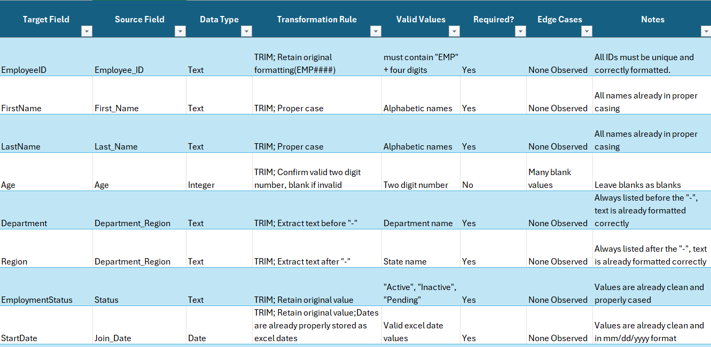
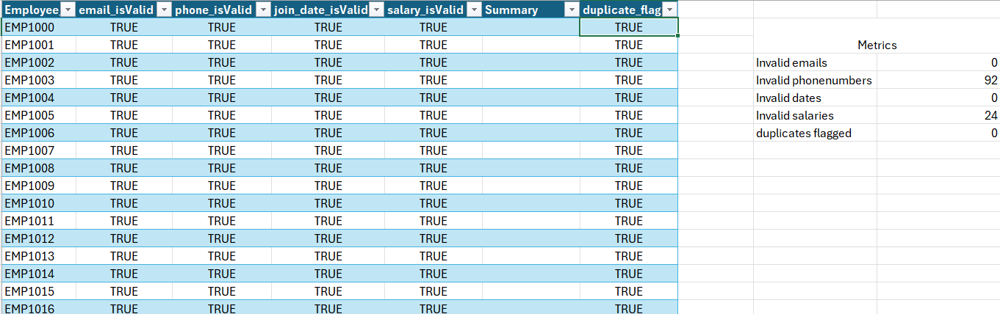

# Employee Data Cleaning & Conversion Pipeline (Excel)

## Project Overview

This project focuses on cleaning, validating, and transforming a messy employee dataset into a structured, analysis-ready format using Excel.

The workflow simulates a real HRIS/ATS data conversion process, including data mapping, field-level cleaning, validation, QA checks, and creation of a final transformed dataset.

The goal was to build a scalable and auditable ETL-style pipeline entirely within Excel, similar to workflows used during HR system migrations and data conversion projects.

---

## Objectives

The goals of this project were to:

- Translate raw HR data into a clean, standardized format
- Build a Data Map documenting valid values and transformation rules
- Apply scalable, formula-driven cleaning logic without manual edits
- Implement a QA framework to validate emails, phone numbers, dates, salaries, and identity integrity
- Produce a final dataset ready for downstream analytics or system import

---

## Tools & Technologies

- Microsoft Excel
- GitHub

---

## Dataset

Source: Synthetic employee dataset containing 1,000+ employee records.

The dataset includes:

- Personal information
- Contact details
- Employment dates
- Salary values

The raw data intentionally contains inconsistent formatting, malformed values, duplicates, noise characters, mixed date types, and edge cases to simulate realistic data-cleaning and migration scenarios.

---

## Excel Workbook

The Excel workbook used for the project is available here:

`excel/employee_conversion.xlsx`

Workbook sheets include:

- `data_map`
- `cleaned_data`
- `QA`
- `employee_dataset`

---

## Key Components

### Data Map

The `data_map` sheet defines:

- Source-to-target field mappings
- Data types
- Transformation rules
- Valid values
- Edge-case handling
- Output formatting requirements

This serves as the transformation and validation reference for the pipeline.

---

### Cleaned Dataset

The `cleaned_data` sheet contains a fully transformed dataset created using scalable Excel formulas and functions, including:

- `LET()`
- `TRIM()`
- `SUBSTITUTE()`
- `TEXT()`
- Numeric validation
- Date normalization
- Phone formatting
- Salary standardization

All transformations are formula-driven and scalable across the dataset.

---

### QA Framework

The `QA` sheet includes validation checks for:

- Email validity
- Phone validity
- Join date validity
- Salary validity
- Duplicate and identity conflict detection
- Problem summary tracking

The QA process also includes metrics summarizing invalid or conflicting records.

This mirrors real-world ETL validation and conversion QA workflows.

---

### Raw Dataset

The `employee_dataset` sheet preserves the original source data to support:

- Duplicate detection
- Identity integrity checks
- Cross-referencing during QA

---

## Process

1. Reviewed the raw dataset and documented transformation requirements in a Data Map
2. Built formula-driven cleaning logic for each field
3. Standardized phone numbers, dates, salary precision, and text formatting
4. Implemented QA checks for validity and identity conflicts
5. Produced a final cleaned dataset ready for export or downstream analysis

---

## Repository Structure

employee-data-cleaning-pipeline/

├── excel/  
│   └── employee_conversion.xlsx  
├── images/  
│   ├── data_map.png  
│   └── qa_sheet.png  
└── README.md  

---

## Skills Demonstrated

- Data cleaning and transformation (Excel)
- Building scalable, formula-driven pipelines
- Data validation and QA frameworks
- Identity integrity and duplicate detection
- Documentation through Data Maps
- ETL-style workflow design

---

## Author

Ethan Long  
Aspiring Data Analyst  

LinkedIn
